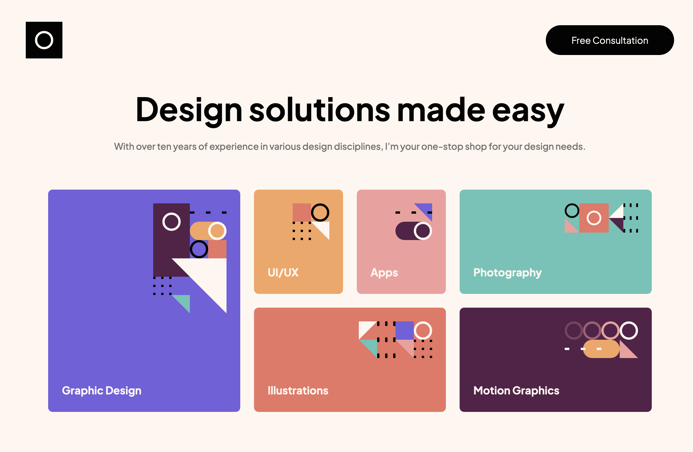

# Frontend Mentor - Single-page design portfolio solution

This is a solution to the [Single-page design portfolio challenge on Frontend Mentor](https://www.frontendmentor.io/challenges/singlepage-design-portfolio-2MMhyhfKVo). Frontend Mentor challenges help you improve your coding skills by building realistic projects. 

## Table of contents

- [Overview](#overview)
  - [The challenge](#the-challenge)
  - [Screenshot](#screenshot)
  - [Links](#links)
- [My process](#my-process)
  - [Built with](#built-with)
  - [What I learned](#what-i-learned)
  - [Continued development](#continued-development)

- [Author](#author)

### The challenge

Users should be able to:

- View the optimal layout for the site depending on their device's screen size
- See hover states for all interactive elements on the page
- Navigate the slider using either their mouse/trackpad or keyboard

### Screenshot

### Links

- Solution URL: [https://www.frontendmentor.io/solutions/singlepage-design-portfolio-RJUnWKs6SY
](https://your-solution-url.com)
- Live Site URL: [https://bliss-spa-portfolio.vercel.app/](https://your-live-site-url.com)
### Built with

- CSS custom properties
- Flexbox
- CSS Grid
- Mobile-first workflow
- SASS
- [React](https://reactjs.org/) - JS library
### What I learned

Basic SASS
React component layouts
CSS grid

### Continued development

Things i would love to continue working on is overal basic layout design, Utilizing css grid.

## Author

- Frontend Mentor - [@BenjaminLee-boop](https://www.frontendmentor.io/profile/BenjaminLee-boop)

